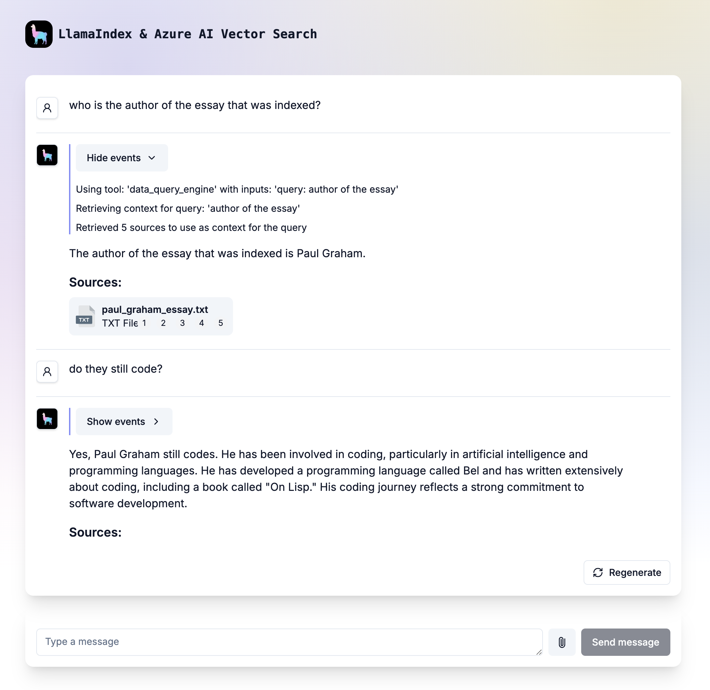
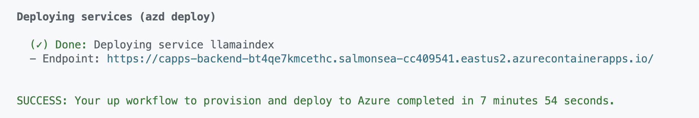

<!-----
name: LlamaIndex RAG chat app with Azure OpenAI and Azure AI Search (JavaScript)
description: Chat with your domain data using LlamaIndex, Azure OpenAI and Azure AI Search.
languages:
- javascript
- typescript
- nodejs
- bicep
- azdeveloper
products:
- azure-openai
- azure-cognitive-search
- aca
- azure
page_type: sample
urlFragment: llamaindex-search-javascript
----->

## LlamaIndex RAG chat app with Azure OpenAI and Azure AI Search (JavaScript)

This solution creates a ChatGPT-like, Retrieval Augmented Generation (RAG) agentic application, over your own documents, powered by Llamaindex (TypeScript). It uses Azure OpenAI Service to access GPT models and embedding, and Azure AI Search for data indexing and retrieval.

Learn more about developing AI apps using [Azure AI Services](https://aka.ms/azai).

[](https://github.com/codespaces/new?hide_repo_select=true&ref=main&repo=890591076&machine=standardLinux32gb&devcontainer_path=.devcontainer%2Fdevcontainer.json&location=WestUs2)
[](https://vscode.dev/redirect?url=vscode://ms-vscode-remote.remote-containers/cloneInVolume?url=https://github.com/azure-samples/llamaindex-search-javascript)

## Important Security Notice

This template, the application code and configuration it contains, has been built to showcase Microsoft Azure specific services and tools. We strongly advise our customers not to make this code part of their production environments without implementing or enabling additional security features. See our [productionizing guide](docs/prod.md) for tips, and consult the [Azure OpenAI Landing Zone reference architecture](https://techcommunity.microsoft.com/blog/azurearchitectureblog/azure-openai-landing-zone-reference-architecture/3882102) for more best practices.

## Table of Contents

- [Azure account requirements](#azure-account-requirements)
  - [Cost estimation](#cost-estimation)
- [Getting Started](#getting-started)
  - [GitHub Codespaces](#github-codespaces)
  - [VS Code Dev Containers](#vs-code-dev-containers)
  - [Local environment](#local-environment)
- [Deploying](#deploying)
  - [Deploying again](#deploying-again)
- [Running the development server](#running-the-development-server)
- [Using the app](#using-the-app)
- [Clean up](#clean-up)
- [Guidance](#guidance)



The repo includes sample data so it's ready to try end to end. In this sample application we use one of Paul Graham's essays, [What I Worked On](https://paulgraham.com/worked.html), and the experience allows you to ask questions about this essay.

### Architecture Diagram


## Azure account requirements

**IMPORTANT:** In order to deploy and run this example, you'll need:

- **Azure account**. If you're new to Azure, [get an Azure account for free](https://azure.microsoft.com/free/cognitive-search/) and you'll get some free Azure credits to get started.
- **Azure account permissions**:
  - Your Azure account must have `Microsoft.Authorization/roleAssignments/write` permissions, such as [Role Based Access Control Administrator](https://learn.microsoft.com/azure/role-based-access-control/built-in-roles#role-based-access-control-administrator-preview), [User Access Administrator](https://learn.microsoft.com/azure/role-based-access-control/built-in-roles#user-access-administrator), or [Owner](https://learn.microsoft.com/azure/role-based-access-control/built-in-roles#owner). If you don't have subscription-level permissions, you must be granted [RBAC](https://learn.microsoft.com/azure/role-based-access-control/built-in-roles#role-based-access-control-administrator-preview) for an existing resource group and [deploy to that existing group](docs/deploy_existing.md#resource-group).
  - Your Azure account also needs `Microsoft.Resources/deployments/write` permissions on the subscription level.

### Cost estimation

Pricing varies per region and usage, so it isn't possible to predict exact costs for your usage.
However, you can try the [Azure pricing calculator](https://azure.com/e/a87a169b256e43c089015fda8182ca87) for the resources below.

* Azure Container Apps: Consumption plan with 1 CPU core, 2.0 GB RAM. Pricing with Pay-as-You-Go. [Pricing](https://azure.microsoft.com/pricing/details/container-apps/)
* Azure OpenAI: Standard tier, gpt-4 and text-embedding-3-large models. Pricing per 1K tokens used. [Pricing](https://azure.microsoft.com/pricing/details/cognitive-services/openai-service/)
* Azure AI Search: Standard tier, 1 replica, free level of semantic search. Pricing per hour. [Pricing](https://azure.microsoft.com/pricing/details/search/)
* Azure Blob Storage: Standard tier with ZRS (Zone-redundant storage). Pricing per storage and read operations. [Pricing](https://azure.microsoft.com/pricing/details/storage/blobs/)
* Azure Monitor: Pay-as-you-go tier. Costs based on data ingested. [Pricing](https://azure.microsoft.com/pricing/details/monitor/)

To reduce costs, you can switch to free SKUs for various services, but those SKUs have limitations.

 To avoid unnecessary costs, remember to take down your app if it's no longer in use,
either by deleting the resource group in the Portal or running `azd down`.

## Getting Started

You have a few options for setting up this project.
The easiest way to get started is GitHub Codespaces, since it will setup all the tools for you,
but you can also [set it up locally](#local-environment) if desired.

### GitHub Codespaces

You can run this repo virtually by using GitHub Codespaces, which will open a web-based VS Code in your browser:

[](https://github.com/codespaces/new?hide_repo_select=true&ref=main&repo=599293758&machine=standardLinux32gb&devcontainer_path=.devcontainer%2Fdevcontainer.json&location=WestUs2)

Once the codespace opens (this may take several minutes), open a terminal window.

### VS Code Dev Containers

A related option is VS Code Dev Containers, which will open the project in your local VS Code using the [Dev Containers extension](https://marketplace.visualstudio.com/items?itemName=ms-vscode-remote.remote-containers):

1. Start Docker Desktop (install it if not already installed)
2. Open the project:
    [](https://vscode.dev/redirect?url=vscode://ms-vscode-remote.remote-containers/cloneInVolume?url=https://github.com/azure-samples/azure-search-openai-demo)

3. In the VS Code window that opens, once the project files show up (this may take several minutes), open a terminal window.

### Local environment

1. Install the required tools:

    - [Azure Developer CLI](https://aka.ms/azure-dev/install)
    - [Node.js 20+](https://nodejs.org/download/)
    - [Git](https://git-scm.com/downloads)
    - [Powershell 7+ (pwsh)](https://github.com/powershell/powershell) - For Windows users only.
      - **Important**: Ensure you can run `pwsh.exe` from a PowerShell terminal. If this fails, you likely need to upgrade PowerShell.

2. Create a new folder and switch to it in the terminal.
3. Run this command to download the project code:

    ```shell
    azd init -t llamaindex-search-javascript
    ```

Note that this command will initialize a git repository, so you do not need to clone this repository.

## Deploying

The steps below will provision Azure resources and deploy the application code to Azure Container Apps.

1. Login to your Azure account:

    ```shell
    azd auth login
    ```

    For GitHub Codespaces users, if the previous command fails, try:

   ```shell
    azd auth login --use-device-code
    ```

1. Create a new azd environment:

    ```shell
    azd env new
    ```

    Enter a name that will be used for the resource group.
    This will create a new folder in the `.azure` folder, and set it as the active environment for any calls to `azd` going forward.
1. Run `azd up` - This will provision Azure resources and deploy this sample to those resources, including building the search index based on the files found in the `./data` folder.
    - **Important**: Beware that the resources created by this command will incur immediate costs, primarily from the AI Search resource. These resources may accrue costs even if you interrupt the command before it is fully executed. You can run `azd down` or delete the resources manually to avoid unnecessary spending.
    - You will be prompted to select two locations, one for the majority of resources and one for the OpenAI resource, which is currently a short list. That location list is based on the [OpenAI model availability table](https://learn.microsoft.com/azure/cognitive-services/openai/concepts/models#model-summary-table-and-region-availability) and may become outdated as availability changes.
1. After the application has been successfully deployed you will see a URL printed to the console.  Click that URL to interact with the application in your browser.

It will look like the following:



> NOTE: It may take 5-10 minutes after you see 'SUCCESS' for the application to be fully deployed.

### Deploying again

If you've only changed the Next.js app code in the [`app`](./app/) folder, then you don't need to re-provision the Azure resources. You can just run:

```shell
azd deploy
```

If you've changed the infrastructure files ([`infra`](./infra/) folder or [`azure.yaml`](./azure.yaml)), then you'll need to re-provision the Azure resources. You can do that by running:

```shell
azd up
```

## Running the development server

You can run a development server locally **after** having successfully run the `azd up` (or simply `azd provision`) command. If you haven't yet, follow the [deploying](#deploying) steps above.

First, `azd auth login` to authenticate to your Azure account.

Then, install the project dependencies:

```
npm install
```

Next, generate the embeddings of the documents in the [./data](./data) directory:

```
npm run generate
```

Third, run the development server:

```
npm run dev
```

Open [http://localhost:3000](http://localhost:3000) with your browser to see the result.


### Using Docker (optional)

1. Build an image for the Next.js app:

```
docker build -t llamaindex-search-javascript .
```

1. Generate embeddings:

Parse the data and generate the vector embeddings if the `./data` folder exists - otherwise, skip this step:

```
docker run \
  --rm \
  -v $(pwd)/.env:/app/.env \ # Use ENV variables and configuration from your file-system
  -v $(pwd)/config:/app/config \
  -v $(pwd)/data:/app/data \
  -v $(pwd)/cache:/app/cache \ # Use your file system to store the vector database
  llamaindex-search-javascript \
  npm run generate
```

1. Start the app:

```
docker run \
  --rm \
  -v $(pwd)/.env:/app/.env \ # Use ENV variables and configuration from your file-system
  -v $(pwd)/config:/app/config \
  -v $(pwd)/cache:/app/cache \ # Use your file system to store gea vector database
  -p 3000:3000 \
  llamaindex-search-javascript
```

## Using the app

- In Azure: navigate to the Azure app deployed by `azd`. The URL is printed out when `azd` completes (as "Endpoint"), or you can find it in the Azure portal.
- Running locally: navigate to [http://localhost:3000](http://localhost:3000)

## Clean up

To clean up all the resources created by this sample:

1. Run `azd down`
2. When asked if you are sure you want to continue, enter `y`
3. When asked if you want to permanently delete the resources, enter `y`

NOTE: you can also run `azd down --purge --force`.

The resource group and all the resources will be deleted.

# Guidance

You can find extensive documentation in the [docs](docs/README.md) folder:

- Deploying:
  - [Troubleshooting deployment](docs/deploy_troubleshooting.md)
  - [Deploying with azd: deep dive and CI/CD](docs/azd.md)
  - [Enabling optional features](docs/features.md)
- [Productionizing](docs/prod.md)
